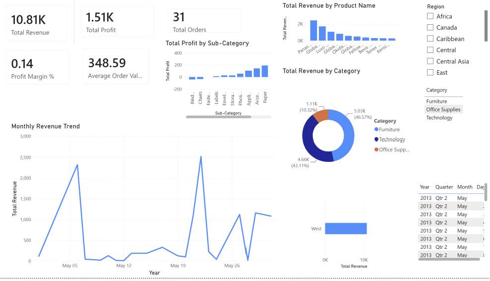

# powerbi-sales-dashboard

## Overview
This project analyzes sales performance across regions, products, and time periods using Power BI.

## Key Insights
- Revenue trends over time
- Top-performing products
- Regional performance comparison

## Tools Used
- Power BI
- Excel / CSV

## Dashboard Preview

## Files
- `Retail_Sales_Dashboard.pbix`: Power BI report file
- `superstore`: Source dataset

## How to Use
1. Download the PBIX file
2. Open in Power BI Desktop
3. Refresh data if needed
